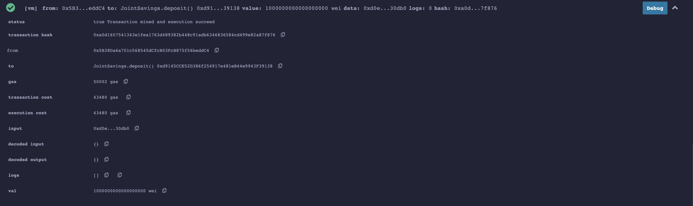
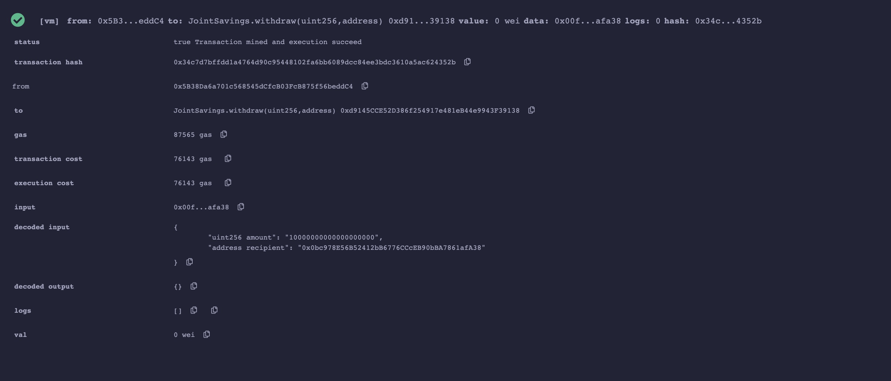

# Unit-20-Solidity Homework

This homework assignment creates a `Solidity` based smart-contract for Joint Accounts transactions.  The smart-contract will allow use ether management functions to provide the features of the joint savings account.

These features will consist of the ability to deposit and withdraw funds from the account. app called Fintech Finder, which allows the user to look for a Fintech professionals, their hourly rates,  hire them and pay them through `Ethereum` blockchain network.

## Joint Savings Smart Contract

The `Solidity` file [joint_savings.sol](code/joint_savings.sol) creates a solidity smart contract which allows the following functions.

- `setAccounts` function which takes two input account addresses of type `address payable` and sets it as the two account holders in the smart-contract.
- `deposit` function which takes the  deposit and sets it as the `contractBalance`. 
- `withdraw` function which takes the `amount` and 'address payable` recipient as the input and withdraws the requested amount within the contract to the requested address.  Before withdrawing the amount, the following checks are executed:
    
    - The recipient is either of the account holders as per the smart-contract setup.
    - The smart-contract has enough balance to execute a withdraw i.e. the amount requested to withdraw is lesser than the amount in the contract.  

    The above two conditions are mandatory without which the `withdraw` function does not execute and rolls back.

    In addition, the function also records the last address that executed the `withdraw` successfully and also the amount that was withdrawn.  The contract balance within the smart-contract is updated to reflect the new balance after withdrawal.

- A `fallback` function is also defined so that your contract can store ether that’s sent from outside the deposit function.

## Execution Results

### Initial Deployment

The smart-contract is deployed in the Javascript VM.

### Set Accounts

The `setAccounts` function is executed with two account addresses.

### Deposit Function

The `deposit` function is executed for three different transactions.

#### Transaction 1 - Send 1 ether or 1000000000000000000 wei.

#### Contract Balance after first deposit of 1 ether or 1000000000000000000 wei.

#### Transaction 2 - Send 10 ether or 10000000000000000000 wei.

#### Contract Balance after second deposit of 10 ether or 10000000000000000000 wei.

#### Transaction 3 - Send 5 ether or 5000000000000000000 wei.

#### Contract Balance after 3rd deposit of 5 ether or 5000000000000000000 wei.

### Withdrawal Function
The `withdrawal` function is executed for two different transactions.
#### Withdrawal 1 - Withdraw 5 ether or 5000000000000000000 wei to account holder 1.

#### Contract Balance after Withdrawal 1

#### Last to withdraw and amount withdrawn

#### Withdrawal 2 - Withdraw 10 ether or 10000000000000000000 wei to account holder 2.

#### Contract Balance after Withdrawal 2

#### Last to withdraw and amount withdrawn

### Exceeding Balance
With the original balance of 16 ethers after two deposits, and subsequently withdrawing 10 ethers after two withdrawals, the current `contractBalance` is 1 ether or 1000000000000000000 wei.

When now trying to withdraw 5 either or 5000000000000000000 wei, we get an error due to a mandatory check in the `withdrawal` function.

